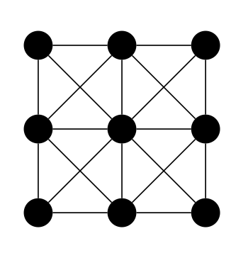

# Plodon

cf. Colin Beveridge's [alfabet](https://github.com/icecolbeveridge/alfabet/).

Combinatorics for [Will](https://www.wmad.co.uk/about/)'s alien alphabet.

Q: How many "letters" can be made, where each letter is two non-crossing paths made by connecting three distinct adjacent points in a 3-by-3 grid?

i.e. we wish to count the ways to draw two distinct paths of length 2 which do not cross in the following graph.

A: I agree with Colin's 552. 

The approach here is to make the graph (in networkx), find the 80 possible single paths and, for each, make the graph of remaining vertices and edges that don't lead to crossings and count the number of 2-paths within this. 

This counts all possible pairs of paths twice, i.e. each pair (path1, path2) is also counted the other way around. 

The output from running `plodon.py`:

1. path 1 is 1-2-3; 32 options for path 2
2. path 1 is 1-2-4; 27 options for path 2
3. path 1 is 1-2-5; 12 options for path 2
4. path 1 is 1-2-6; 19 options for path 2
5. path 1 is 1-4-2; 27 options for path 2
6. path 1 is 1-4-5; 12 options for path 2
7. path 1 is 1-4-7; 32 options for path 2
8. path 1 is 1-4-8; 19 options for path 2
9. path 1 is 1-5-2; 12 options for path 2
10. path 1 is 1-5-3; 10 options for path 2
11. path 1 is 1-5-4; 12 options for path 2
12. path 1 is 1-5-6; 5 options for path 2
13. path 1 is 1-5-7; 10 options for path 2
14. path 1 is 1-5-8; 5 options for path 2
15. path 1 is 1-5-9; 6 options for path 2
16. path 1 is 2-1-4; 27 options for path 2
17. path 1 is 2-1-5; 12 options for path 2
18. path 1 is 2-3-5; 12 options for path 2
19. path 1 is 2-3-6; 27 options for path 2
20. path 1 is 2-4-5; 7 options for path 2
21. path 1 is 2-4-7; 19 options for path 2
22. path 1 is 2-4-8; 8 options for path 2
23. path 1 is 2-5-3; 12 options for path 2
24. path 1 is 2-5-4; 7 options for path 2
25. path 1 is 2-5-6; 7 options for path 2
26. path 1 is 2-5-7; 5 options for path 2
27. path 1 is 2-5-8; 2 options for path 2
28. path 1 is 2-5-9; 5 options for path 2
29. path 1 is 2-6-3; 27 options for path 2
30. path 1 is 2-6-5; 7 options for path 2
31. path 1 is 2-6-8; 8 options for path 2
32. path 1 is 2-6-9; 19 options for path 2
33. path 1 is 3-2-4; 19 options for path 2
34. path 1 is 3-2-5; 12 options for path 2
35. path 1 is 3-2-6; 27 options for path 2
36. path 1 is 3-5-4; 5 options for path 2
37. path 1 is 3-5-6; 12 options for path 2
38. path 1 is 3-5-7; 6 options for path 2
39. path 1 is 3-5-8; 5 options for path 2
40. path 1 is 3-5-9; 10 options for path 2
41. path 1 is 3-6-5; 12 options for path 2
42. path 1 is 3-6-8; 19 options for path 2
43. path 1 is 3-6-9; 32 options for path 2
44. path 1 is 4-1-5; 12 options for path 2
45. path 1 is 4-2-5; 7 options for path 2
46. path 1 is 4-2-6; 8 options for path 2
47. path 1 is 4-5-6; 2 options for path 2
48. path 1 is 4-5-7; 12 options for path 2
49. path 1 is 4-5-8; 7 options for path 2
50. path 1 is 4-5-9; 5 options for path 2
51. path 1 is 4-7-5; 12 options for path 2
52. path 1 is 4-7-8; 27 options for path 2
53. path 1 is 4-8-5; 7 options for path 2
54. path 1 is 4-8-6; 8 options for path 2
55. path 1 is 4-8-7; 27 options for path 2
56. path 1 is 4-8-9; 19 options for path 2
57. path 1 is 5-2-6; 7 options for path 2
58. path 1 is 5-3-6; 12 options for path 2
59. path 1 is 5-4-7; 12 options for path 2
60. path 1 is 5-4-8; 7 options for path 2
61. path 1 is 5-6-8; 7 options for path 2
62. path 1 is 5-6-9; 12 options for path 2
63. path 1 is 5-7-8; 12 options for path 2
64. path 1 is 5-8-6; 7 options for path 2
65. path 1 is 5-8-7; 12 options for path 2
66. path 1 is 5-8-9; 12 options for path 2
67. path 1 is 5-9-6; 12 options for path 2
68. path 1 is 5-9-8; 12 options for path 2
69. path 1 is 6-5-7; 5 options for path 2
70. path 1 is 6-5-8; 7 options for path 2
71. path 1 is 6-5-9; 12 options for path 2
72. path 1 is 6-8-7; 19 options for path 2
73. path 1 is 6-8-9; 27 options for path 2
74. path 1 is 6-9-8; 27 options for path 2
75. path 1 is 7-4-8; 27 options for path 2
76. path 1 is 7-5-8; 12 options for path 2
77. path 1 is 7-5-9; 10 options for path 2
78. path 1 is 7-8-9; 32 options for path 2
79. path 1 is 8-5-9; 12 options for path 2
80. path 1 is 8-6-9; 27 options for path 2
Total: 1104
